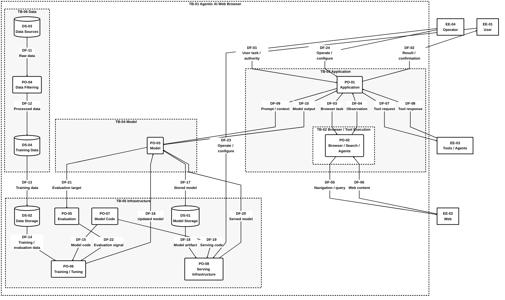
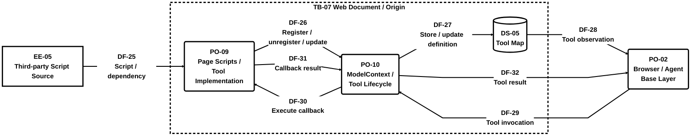

# Threat Model for Agentic AI Web Browsers

## Abstract

This document records an initial threat model for artificial intelligence (AI)
agents that use a web browser, or a browser-like execution environment, on
behalf of a user. It identifies the system under analysis, initial assumptions,
threat candidates, draft responses, and remaining review work.

The model has two layers. The base layer covers agentic AI web browsing without
depending on a particular tool protocol. A provisional WebMCP extension records
the architectural delta, threat candidates, and response candidates that
depend on WebMCP mechanisms. The extension remains in this document until it
is complete enough to maintain as a separate WebMCP threat model.

The central concern is the combination of web content, model output, browser
state, tool access, and user authority in the same workflow. The document is
intended to support discussion and iteration; it is not a complete analysis of
any particular product or implementation.

## Status of This Document

This document is an initial threat model for agentic AI web browsers and
computer-using agents that interact with the Web through a browser-like
environment.

This document is informative. It is a working draft and records the current
model, the first set of threats, draft responses, and open questions for
discussion. It does not represent W3C consensus, a browser-vendor commitment,
or a complete security analysis of any specific product.

The WebMCP material is a provisional extension of the base model. It does not
claim that WebMCP is present in every agentic browser or that the extension is
a complete threat model of the WebMCP specification.

Editor: Simone Onofri (W3C) <simone@w3.org>

## Introduction

### Scope

This threat model focuses on an agent that can use a web browser, or a
browser-like execution environment, on behalf of a user. The agent can read web
content, reason over it with a model, choose actions, and use browser state,
tools, application programming interfaces (APIs), credentials, or forms to
complete a task.

The model includes:

- the user who delegates a task;
- the agent application that plans and coordinates work;
- the model used by the agent;
- the browser or browser automation component;
- websites and other external sources that provide content to the agent;
- data stores, model-serving infrastructure, and tool integrations that affect
  the agent's behavior.

The document separates that base system from a provisional WebMCP extension:

- **Base layer**: components, flows, threats, and responses that can exist in
  agentic AI web browsing without WebMCP.
- **WebMCP extension**: a zoomed-in model of WebMCP tool registration,
  discovery, invocation, lifecycle state, and structured tool metadata.

The extension refines selected base-layer elements and flows. It does not make
WebMCP part of the base system boundary. Threats that exist without WebMCP stay
in the base layer even when WebMCP provides another delivery path.

The model does not try to cover every integration between AI and the Web. For
AI functionality exposed directly to web applications through browser APIs, see
the related [AI in the Browser](./ai-in-browser.md) threat model. This document
also uses the [Threat Model for the Web](https://github.com/w3c/threat-model-web)
as background context.

### Method

This document follows Shostack's four-question frame for threat modeling:

- What are we working on?
- What can go wrong?
- What are we going to do about it?
- Did we do a good enough job?

The current draft uses STRIDE (Spoofing, Tampering, Repudiation, Information
Disclosure, Denial of Service, and Elevation of Privilege) as a security prompt
set, together with AI-specific prompts from sources such as the Open Worldwide
Application Security Project (OWASP) AI Testing Guide, the OWASP Top 10 for
Large Language Model (LLM) Applications, and Google's Secure AI Framework
(SAIF) (Google, 2025; Meucci and Morana, 2025). These frameworks are prompts
for analysis. They are not evidence that a threat applies to every agentic
browser or that a response is sufficient.

### Scenario

Consider a user who wants to add local holidays to an internal HR system. A
normal browser workflow might be:

- open a government website and find the public holidays for a city;
- copy or record the relevant dates;
- open the HR system;
- authenticate;
- enter the dates.

A scripted web agent might automate those steps with browser automation,
structured parsing, and credentials supplied at runtime. An AI web agent adds a
model to that workflow. It can interpret the task, inspect pages, decide which
links or forms matter, recover from unexpected page structure, and continue
until it believes the task is complete.

The useful part and the dangerous part are close together. The agent can bridge
messy web interactions. It can also be influenced by the same pages it is
reading, by stale or poisoned data, by tool output, by other agents, or by a
misleading interpretation of the user's goal.

### Agent Patterns in Scope

For this document, the relevant agent patterns are adapted from Lanham (2025):

- **Direct assistant**: the user talks to a model, and the model returns text.
- **Tool-using assistant**: the model can call tools or APIs and return a
  result.
- **Browser-using agent**: the model can inspect web content and drive a
  browser or browser automation component.
- **Autonomous or semi-autonomous agent**: the model decomposes the task, plans
  steps, invokes tools, observes results, and replans.
- **Multi-agent system**: several agents exchange messages, delegate work, or
  consume each other's output.

The browser-using and autonomous patterns are the main focus here. They create
the clearest authority boundary problem: content from the Web can become input
to a component that also has access to user authority.

### A Note on "Intelligence"

This model does not depend on whether AI systems should be called intelligent.
That question is discussed elsewhere (Baker, 2019; Gigerenzer, 2022; Hoffmann,
2022). The security issue is more practical. A model can be useful for
classification, planning, summarization, and interaction with messy interfaces,
but its output is probabilistic and context-sensitive (Atil et al., 2024; Yu et
al., 2025). The same system may behave differently under different prompts,
page content, tool outputs, model versions, or policy settings.

For threat modeling, that means model output should not be treated as a
security boundary. The agent architecture needs explicit controls around
authority, data flow, user consent, tool access, logging, and recovery from
mistakes.

## What Are We Working On?

### Agents and User Agents

In this document, an agent is software that acts toward a goal on behalf of a
principal. This narrower software definition builds on the general meaning of
"agent" as someone or something that acts (Merriam-Webster, n.d.). The
principal is usually the user, but a deployed system can also give the agent
goals, permissions, policies, or tool access.

The Web already has the concept of a user agent. Yasskin and Capadisli (2025)
describe a web user agent as software that interacts with websites on behalf of
its user. A browser acts on behalf of a user when it requests web content,
renders it, stores state, sends credentials, and exposes user-mediated
capabilities. Agentic AI changes that relationship because the user is no
longer directly choosing every step. The agent may read content, interpret it,
decide the next action, and invoke browser capabilities without the user seeing
every intermediate state.

That difference is the central security question for this model: when a web
page, a model, a tool, and a browser all contribute to an action, which input is
trusted, which authority is being used, and where can the user still make an
informed decision?

### Base Model: Agentic AI Web Browser

At a high level, and following the application/model/infrastructure/data
framing used by AI security guidance (Google, 2025; Meucci and Morana, 2025),
an agentic AI web browser includes four areas:

- **Application**: the agent application, orchestration logic, input handling,
  output handling, policies, and tool-selection logic.
- **Model**: the model or models used for interpretation, planning, generation,
  classification, or evaluation.
- **Infrastructure**: model serving, storage, logging, evaluation, model
  repositories, application hosting, and dependency management.
- **Data**: user prompts, browser-visible content, cookies, credentials,
  session state, tool responses, training data, tuning data, memories, logs, and
  external sources.

Important external entities include the user, websites, identity providers,
other agents, tool providers, extension providers, model providers, and
operators of infrastructure used by the agent.

### Base Data Flow Diagram

The following Data Flow Diagram (DFD) is informative and intentionally high
level. It adapts the application, model, infrastructure, and data grouping from
the SAIF model and the OWASP AI Testing Guide to the agentic AI web browser
case (Google, 2025; Meucci and Morana, 2025). The same model is also reflected
in *W3C - Threat Modeling Agentic AI Web Browsers @ WebEvolve2025* (Onofri,
2025), which is the public presentation based on this threat model.

<!-- markdownlint-disable MD013 -->

```mermaid
%%{init: {"theme":"base","themeCSS":".nodeLabel,.edgeLabel,.cluster-label,.label{font-family:Arial,sans-serif!important;font-weight:bold!important;}","flowchart":{"htmlLabels":true,"curve":"linear","nodeSpacing":80,"rankSpacing":95,"padding":18},"themeVariables":{"fontFamily":"Arial, sans-serif","fontSize":"22px","primaryColor":"#fff","primaryTextColor":"#000","primaryBorderColor":"#000","lineColor":"#000","secondaryColor":"#fff","tertiaryColor":"#fff","edgeLabelBackground":"#fff","clusterBkg":"#fff","clusterBorder":"#000"}}}%%
flowchart TB

  EE1_User[EE-01<br/>User]
  EE2_Web[EE-02<br/>Web]
  EE3_Tools[EE-03<br/>Tools / Agents]
  EE4_Operator[EE-04<br/>Operator]

  subgraph TB1_AgenticBrowser["TB-01 Agentic AI Web Browser"]
    direction TB

    subgraph TB3_Application["TB-03 Application"]
      direction TB
      PO1_Application(PO-01<br/>Application)

      subgraph TB2_BrowserTools["TB-02 Browser / Tool Execution"]
        PO2_Browser(PO-02<br/>Browser / Search / Agents)
      end
    end

    subgraph TB4_Model["TB-04 Model"]
      PO3_Model(PO-03<br/>Model)
    end

    subgraph TB5_Infrastructure["TB-05 Infrastructure"]
      direction TB
      PO5_Evaluation(PO-05<br/>Evaluation)
      PO6_TrainingTuning(PO-06<br/>Training / Tuning)
      PO7_ModelCode(PO-07<br/>Model Code)
      PO8_ModelServing(PO-08<br/>Serving Infrastructure)
      DS1_ModelStore[(DS-01<br/>Model Storage)]
      DS2_DataStore[(DS-02<br/>Data Storage)]
    end

    subgraph TB6_Data["TB-06 Data"]
      direction TB
      DS3_DataSources[(DS-03<br/>Data Sources)]
      PO4_DataFiltering(PO-04<br/>Data Filtering)
      DS4_TrainingData[(DS-04<br/>Training Data)]
    end
  end

  EE1_User ==>|DF-01<br/>User task / authority| PO1_Application
  PO1_Application ==>|DF-02<br/>Result / confirmation| EE1_User

  PO1_Application ==>|DF-03<br/>Browser task| PO2_Browser
  PO2_Browser ==>|DF-04<br/>Observation| PO1_Application

  PO2_Browser ==>|DF-05<br/>Navigation / query| EE2_Web
  EE2_Web ==>|DF-06<br/>Web content| PO2_Browser

  PO1_Application ==>|DF-07<br/>Tool request| EE3_Tools
  EE3_Tools ==>|DF-08<br/>Tool response| PO1_Application

  PO1_Application ==>|DF-09<br/>Prompt / context| PO3_Model
  PO3_Model ==>|DF-10<br/>Model output| PO1_Application

  DS3_DataSources ==>|DF-11<br/>Raw data| PO4_DataFiltering
  PO4_DataFiltering ==>|DF-12<br/>Processed data| DS4_TrainingData
  DS4_TrainingData ==>|DF-13<br/>Training data| DS2_DataStore
  DS2_DataStore ==>|DF-14<br/>Training / evaluation data| PO6_TrainingTuning
  PO7_ModelCode ==>|DF-15<br/>Model code| PO6_TrainingTuning
  PO6_TrainingTuning ==>|DF-16<br/>Updated model| PO3_Model
  PO3_Model ==>|DF-17<br/>Stored model| DS1_ModelStore
  DS1_ModelStore ==>|DF-18<br/>Model artifact| PO8_ModelServing
  PO7_ModelCode ==>|DF-19<br/>Serving code| PO8_ModelServing
  PO8_ModelServing ==>|DF-20<br/>Served model| PO3_Model
  PO3_Model ==>|DF-21<br/>Evaluation target| PO5_Evaluation
  PO5_Evaluation ==>|DF-22<br/>Evaluation signal| PO6_TrainingTuning

  EE4_Operator ==>|DF-23<br/>Operate / configure| PO8_ModelServing
  EE4_Operator ==>|DF-24<br/>Operate / configure| PO1_Application

  classDef default fill:#fff,stroke:#000,stroke-width:4px,color:#000,font-size:22px,font-weight:bold,font-family:Arial

  style TB1_AgenticBrowser fill:#ffffff,stroke:#000000,stroke-width:4px,stroke-dasharray:8 6,color:#000000
  style TB2_BrowserTools fill:#ffffff,stroke:#000000,stroke-width:4px,stroke-dasharray:8 6,color:#000000
  style TB3_Application fill:#f7f7f7,stroke:#000000,stroke-width:4px,stroke-dasharray:8 6,color:#000000
  style TB4_Model fill:#f7f7f7,stroke:#000000,stroke-width:4px,stroke-dasharray:8 6,color:#000000
  style TB5_Infrastructure fill:#f7f7f7,stroke:#000000,stroke-width:4px,stroke-dasharray:8 6,color:#000000
  style TB6_Data fill:#f7f7f7,stroke:#000000,stroke-width:4px,stroke-dasharray:8 6,color:#000000

  linkStyle default stroke:#000,stroke-width:3px,color:#000
```

<!-- markdownlint-enable MD013 -->

### Base DFD Dictionary

<!-- markdownlint-disable MD013 -->

#### External Entities

| Candidate ID | Element type | Name | Description | Source | Evidence status |
| --- | --- | --- | --- | --- | --- |
| `EE-01` | External Entity | User | Person who delegates a task and provides user authority, prompts, approvals, credentials, or other task context to the agent. | Yasskin and Capadisli (2025); Context. | inferred |
| `EE-02` | External Entity | Web | Websites and external web content that the browser-using agent can search, open, parse, summarize, or act on. | W3C Threat Model for the Web; Context. | inferred |
| `EE-03` | External Entity | Tools / Agents | External tools, plugins, APIs, extensions, or other agents that can exchange input and output with the agent application. | Lanham (2025); Meucci and Morana (2025). | inferred |
| `EE-04` | External Entity | Operator | Organization or service operator that configures, deploys, or administers the agent application or model-serving infrastructure. | Google SAIF Map of AI Risks and Controls; OWASP AI Testing Guide. | inferred |

#### Processes

| Candidate ID | Element type | Name | Description | Source | Evidence status |
| --- | --- | --- | --- | --- | --- |
| `PO-01` | Process | Application | Orchestration and policy logic that coordinates user input, model use, tool use, browser actions, output handling, and logging. | Google SAIF Map of AI Risks and Controls; OWASP AI Testing Guide. | inferred |
| `PO-02` | Process | Browser / Search / Agents | Browser, browser automation, search/open workflow, or delegated agent execution component that observes web content and performs navigation or task actions. | Yasskin and Capadisli (2025); Lanham (2025). | inferred |
| `PO-03` | Process | Model | AI model or model component used for interpretation, planning, generation, classification, evaluation, or tool-selection support. | Google SAIF Map of AI Risks and Controls; OWASP AI Testing Guide. | inferred |
| `PO-04` | Process | Data Filtering | Filtering and processing of source data before it is used as training or tuning data. | Google SAIF Map of AI Risks and Controls. | inferred |
| `PO-05` | Process | Evaluation | Evaluation activity that assesses model behavior, quality, safety, or other properties and can feed signals into training or tuning. | Google SAIF Map of AI Risks and Controls. | inferred |
| `PO-06` | Process | Training / Tuning | Model training or tuning process that uses stored training data, model code, and operational configuration to produce or update a model. | Google SAIF Map of AI Risks and Controls. | inferred |
| `PO-07` | Process | Model Code | Model frameworks, code, configuration, dependencies, or serving code used during model creation or model serving. | Google SAIF Map of AI Risks and Controls. | inferred |
| `PO-08` | Process | Serving Infrastructure | Serving infrastructure that loads model artifacts and makes model functionality available to the application or runtime. | Google SAIF Map of AI Risks and Controls. | inferred |

#### Data Stores

| Candidate ID | Element type | Name | Description | Source | Evidence status |
| --- | --- | --- | --- | --- | --- |
| `DS-01` | Data Store | Model Storage | Storage for model artifacts or model-related material used by serving infrastructure. | Google SAIF Map of AI Risks and Controls. | inferred |
| `DS-02` | Data Store | Data Storage | Storage for training, tuning, evaluation, logs, or other data used by infrastructure processes. | Google SAIF Map of AI Risks and Controls. | inferred |
| `DS-03` | Data Store | Data Sources | Source data used to create, tune, or evaluate model behavior. | Google SAIF Map of AI Risks and Controls. | inferred |
| `DS-04` | Data Store | Training Data | Training or tuning data after filtering and processing. | Google SAIF Map of AI Risks and Controls. | inferred |

#### Trust Boundaries

| Candidate ID | Element type | Boundary | Contains or separates | Why it is a boundary | Crossing flows | Source | Evidence status |
| --- | --- | --- | --- | --- | --- | --- | --- |
| `TB-01` | Trust Boundary | Agentic AI Web Browser | Contains `PO-01` through `PO-08` and `DS-01` through `DS-04`; separates the modeled system from `EE-01` through `EE-04`. | System boundary for authority, responsibility, operation, and data handling. | `DF-01`, `DF-02`, `DF-05`, `DF-06`, `DF-07`, `DF-08`, `DF-23`, `DF-24` | Context. | inferred |
| `TB-02` | Trust Boundary | Browser / Tool Execution | Contains `PO-02`; separates browser/tool execution from application orchestration. | Boundary for browser-mediated observation and action, tool execution, and web content handling. | `DF-03`, `DF-04`, `DF-05`, `DF-06` | Yasskin and Capadisli (2025). | inferred |
| `TB-03` | Trust Boundary | Application | Contains `PO-01` and `PO-02`; separates application-layer orchestration from model, infrastructure, data, and external entities. | Boundary for application control, user input handling, output handling, policy logic, and action planning. | `DF-01` through `DF-10`, `DF-24` | Google SAIF Map of AI Risks and Controls; OWASP AI Testing Guide. | inferred |
| `TB-04` | Trust Boundary | Model | Contains `PO-03`; separates model behavior from application logic and infrastructure operations. | Boundary for model behavior and model outputs, which are not treated as a security boundary by themselves. | `DF-09`, `DF-10`, `DF-16`, `DF-17`, `DF-20`, `DF-21` | Google SAIF Map of AI Risks and Controls. | inferred |
| `TB-05` | Trust Boundary | Infrastructure | Contains `PO-05`, `PO-06`, `PO-07`, `PO-08`, `DS-01`, and `DS-02`; separates operational infrastructure from application, model, data, and external entities. | Boundary for administrative control over model serving, storage, training/tuning, evaluation, and model code. | `DF-13` through `DF-24` | Google SAIF Map of AI Risks and Controls. | inferred |
| `TB-06` | Trust Boundary | Data | Contains `DS-03`, `PO-04`, and `DS-04`; separates source data, filtering, and training data from infrastructure and model processes. | Boundary for data provenance, filtering, and training-data influence on later model behavior. | `DF-11`, `DF-12`, `DF-13` | Google SAIF Map of AI Risks and Controls. | inferred |

#### Data Flows

| Candidate ID | Element type | From | To | Label | Data or authority transferred | Source | Evidence status |
| --- | --- | --- | --- | --- | --- | --- | --- |
| `DF-01` | Data Flow | `EE-01` | `PO-01` | User task or authority | User goal, delegated authority, prompts, approvals, credentials, or task context. | Context. | inferred |
| `DF-02` | Data Flow | `PO-01` | `EE-01` | Result or confirmation | Task output, status, requests for confirmation, or user-visible result. | Context. | inferred |
| `DF-03` | Data Flow | `PO-01` | `PO-02` | Browser task | Navigation instruction, search request, browser action, or tool-execution request. | Context. | inferred |
| `DF-04` | Data Flow | `PO-02` | `PO-01` | Browser observation | Observed page content, browser state, action result, or execution status. | Context. | inferred |
| `DF-05` | Data Flow | `PO-02` | `EE-02` | Navigation or query | URL request, search query, form submission, or browser-mediated request. | Context. | inferred |
| `DF-06` | Data Flow | `EE-02` | `PO-02` | Web content | Web page content, search results, responses, scripts, or other browser-visible content. | Context; W3C Threat Model for the Web. | inferred |
| `DF-07` | Data Flow | `PO-01` | `EE-03` | Tool request | Tool input, plugin invocation, API request, or delegated agent instruction. | Context; Lanham (2025). | inferred |
| `DF-08` | Data Flow | `EE-03` | `PO-01` | Tool response | Tool output, plugin response, API result, or delegated agent output. | Context; Lanham (2025). | inferred |
| `DF-09` | Data Flow | `PO-01` | `PO-03` | Prompt or context | Prompt, task context, retrieved content, tool output, or policy-relevant context. | Context; Google SAIF Map of AI Risks and Controls. | inferred |
| `DF-10` | Data Flow | `PO-03` | `PO-01` | Model output | Generated text, classification, plan, action proposal, or tool-selection support. | Context; Google SAIF Map of AI Risks and Controls. | inferred |
| `DF-11` | Data Flow | `DS-03` | `PO-04` | Raw data | Source data for filtering and processing. | Google SAIF Map of AI Risks and Controls. | inferred |
| `DF-12` | Data Flow | `PO-04` | `DS-04` | Processed data | Filtered or processed training/tuning data. | Google SAIF Map of AI Risks and Controls. | inferred |
| `DF-13` | Data Flow | `DS-04` | `DS-02` | Training data | Training or tuning dataset stored for infrastructure use. | Google SAIF Map of AI Risks and Controls. | inferred |
| `DF-14` | Data Flow | `DS-02` | `PO-06` | Training or evaluation data | Stored data used for training, tuning, or evaluation. | Google SAIF Map of AI Risks and Controls. | inferred |
| `DF-15` | Data Flow | `PO-07` | `PO-06` | Model code | Model code, configuration, dependencies, or training/tuning code. | Google SAIF Map of AI Risks and Controls. | inferred |
| `DF-16` | Data Flow | `PO-06` | `PO-03` | Updated model | Model update produced by training or tuning. | Google SAIF Map of AI Risks and Controls. | inferred |
| `DF-17` | Data Flow | `PO-03` | `DS-01` | Stored model | Model artifact or model-related material written to storage. | Google SAIF Map of AI Risks and Controls. | inferred |
| `DF-18` | Data Flow | `DS-01` | `PO-08` | Model artifact | Model artifact loaded by serving infrastructure. | Google SAIF Map of AI Risks and Controls. | inferred |
| `DF-19` | Data Flow | `PO-07` | `PO-08` | Serving code | Serving code, configuration, or dependencies. | Google SAIF Map of AI Risks and Controls. | inferred |
| `DF-20` | Data Flow | `PO-08` | `PO-03` | Served model | Served model capability made available at runtime. | Google SAIF Map of AI Risks and Controls. | inferred |
| `DF-21` | Data Flow | `PO-03` | `PO-05` | Evaluation target | Model behavior or model output submitted for evaluation. | Google SAIF Map of AI Risks and Controls. | inferred |
| `DF-22` | Data Flow | `PO-05` | `PO-06` | Evaluation signal | Evaluation result, quality signal, safety signal, or tuning feedback. | Google SAIF Map of AI Risks and Controls. | inferred |
| `DF-23` | Data Flow | `EE-04` | `PO-08` | Operation or configuration | Operational configuration, deployment action, or administrative control for serving infrastructure. | Google SAIF Map of AI Risks and Controls. | inferred |
| `DF-24` | Data Flow | `EE-04` | `PO-01` | Operation or configuration | Operational configuration, policy setting, deployment action, or administrative control for the application. | Google SAIF Map of AI Risks and Controls; OWASP AI Testing Guide. | inferred |

<!-- markdownlint-enable MD013 -->

### Provisional WebMCP Extension

This extension zooms into the parts of the base model that change when a web
document exposes tools through WebMCP. The base model treats the Web as
`EE-02` and browser or tool execution as `PO-02`. The extension decomposes the
web document, its scripts, the `ModelContext` tool registry, and the flows used
to observe and invoke tools. It reuses `PO-02` to keep the relationship with
the base model visible.

This is not yet a standalone WebMCP threat model. The elements below are
provisional and are included so that WebMCP-specific candidates can be attached
to concrete processes, stores, and flows. They are based on the current WebMCP
draft and the threat model evaluated by Lee et al. (2026).

#### WebMCP DFD Overlay

<!-- markdownlint-disable MD013 -->

```mermaid
%%{init: {"theme":"base","themeCSS":".nodeLabel,.edgeLabel,.cluster-label,.label{font-family:Arial,sans-serif!important;font-weight:bold!important;}","flowchart":{"htmlLabels":true,"curve":"linear","nodeSpacing":80,"rankSpacing":95,"padding":18},"themeVariables":{"fontFamily":"Arial, sans-serif","fontSize":"22px","primaryColor":"#fff","primaryTextColor":"#000","primaryBorderColor":"#000","lineColor":"#000","secondaryColor":"#fff","tertiaryColor":"#fff","edgeLabelBackground":"#fff","clusterBkg":"#fff","clusterBorder":"#000"}}}%%
flowchart LR

  EE5_ThirdParty[EE-05<br/>Third-party Script Source]
  PO2_Browser(PO-02<br/>Browser / Agent<br/>Base Layer)

  subgraph TB7_WebDocument["TB-07 Web Document / Origin"]
    direction TB
    PO9_PageScripts(PO-09<br/>Page Scripts /<br/>Tool Implementation)
    PO10_ModelContext(PO-10<br/>ModelContext /<br/>Tool Lifecycle)
    DS5_ToolMap[(DS-05<br/>Tool Map)]
  end

  EE5_ThirdParty ==>|DF-25<br/>Script / dependency| PO9_PageScripts
  PO9_PageScripts ==>|DF-26<br/>Register / unregister / update| PO10_ModelContext
  PO10_ModelContext ==>|DF-27<br/>Store / update definition| DS5_ToolMap
  DS5_ToolMap ==>|DF-28<br/>Tool observation| PO2_Browser
  PO2_Browser ==>|DF-29<br/>Tool invocation| PO10_ModelContext
  PO10_ModelContext ==>|DF-30<br/>Execute callback| PO9_PageScripts
  PO9_PageScripts ==>|DF-31<br/>Callback result| PO10_ModelContext
  PO10_ModelContext ==>|DF-32<br/>Tool result| PO2_Browser

  classDef default fill:#fff,stroke:#000,stroke-width:4px,color:#000,font-size:22px,font-weight:bold,font-family:Arial

  style TB7_WebDocument fill:#ffffff,stroke:#000000,stroke-width:4px,stroke-dasharray:8 6,color:#000000

  linkStyle default stroke:#000,stroke-width:3px,color:#000
```

<!-- markdownlint-enable MD013 -->

#### WebMCP Extension Dictionary

<!-- markdownlint-disable MD013 -->

| Candidate ID | Element type | Name | Description | Specification or source reference | Evidence status |
| --- | --- | --- | --- | --- | --- |
| `EE-05` | External Entity | Third-party Script Source | External source of a script or dependency loaded by the web document. Once loaded, the script executes with the authority available to page script; the separate element records provenance and supply-chain control. | Lee et al. (2026), Threat Model. | verified paper; implementation applicability untested |
| `PO-09` | Process | Page Scripts / Tool Implementation | First-party or third-party page script that defines tool metadata and implements the tool callback. | WebMCP, ModelContextTool Dictionary and Interaction with agents. | verified specification |
| `PO-10` | Process | ModelContext / Tool Lifecycle | WebMCP registration, unregistration, exposure, observation support, invocation mediation, and lifecycle handling associated with a document. | WebMCP, ModelContext Interface and Interaction with agents. | verified specification |
| `DS-05` | Data Store | Tool Map | Document-associated tool definitions, including names, descriptions, schemas, annotations, callbacks, exposure information, and lifecycle state. | WebMCP, Supporting concepts and Page observations. | verified specification |
| `TB-07` | Trust Boundary | Web Document / Origin | Separates document-controlled scripts and tool state from browser-agent observation and invocation. It also makes script provenance visible even where loaded scripts execute with page authority. | WebMCP, ModelContext Interface, Page observations, and Security and Privacy Considerations. | verified specification; provenance aspect inferred |

#### WebMCP Extension Data Flows

| Candidate ID | From | To | Label | Data or authority transferred | Specification or source reference | Evidence status |
| --- | --- | --- | --- | --- | --- | --- |
| `DF-25` | `EE-05` | `PO-09` | Script or dependency | Script code or dependency content loaded into the document. | Lee et al. (2026), Threat Model. | verified paper; general deployment applicability inferred |
| `DF-26` | `PO-09` | `PO-10` | Register, unregister, or update | Tool definition and registration options, or a lifecycle change caused by aborting a registration signal. | WebMCP, ModelContext Interface and ModelContextRegisterToolOptions Dictionary. | verified specification |
| `DF-27` | `PO-10` | `DS-05` | Store or update definition | Tool metadata, callback, exposure information, and current registration state. | WebMCP, registerTool() method steps. | verified specification |
| `DF-28` | `DS-05` | `PO-02` | Tool observation | Tool definitions and associated security information exposed to the browser agent. | WebMCP, Page observations. | verified specification |
| `DF-29` | `PO-02` | `PO-10` | Tool invocation | Selected tool identity and structured arguments. | WebMCP, Interaction with agents. | verified specification |
| `DF-30` | `PO-10` | `PO-09` | Execute callback | Browser-mediated invocation of the registered page callback. | WebMCP, ModelContextTool Dictionary and Event loop integration. | verified specification |
| `DF-31` | `PO-09` | `PO-10` | Callback result | Structured or error result returned by the page's tool implementation. | WebMCP, ModelContextTool Dictionary. | verified specification |
| `DF-32` | `PO-10` | `PO-02` | Tool result | Tool result returned to the browser agent and potentially added to later model context. | WebMCP, Interaction with agents and Security and Privacy Considerations. | verified specification |

<!-- markdownlint-enable MD013 -->

### Assumptions and Follow-up

#### A-01: Authenticated browser state

The user can delegate tasks that require authenticated browser state.

- Evidence status: inferred.
- Follow-up: define which task classes require explicit confirmation.

#### A-02: Untrusted web content

Web content read by the agent is not trusted.

- Evidence status: inferred from the Web threat model.
- Follow-up: map this to concrete browser origin and content boundaries.

#### A-03: Model as non-boundary

The model is not a security boundary.

- Evidence status: inferred from AI/LLM threat sources.
- Follow-up: identify which controls sit outside the model.

#### A-04: Tool authority

The agent may have access to tools with different authority levels.

- Evidence status: inferred.
- Follow-up: inventory tool permissions and delegation paths.

#### A-05: Multi-agent behavior

Multi-agent interactions are possible but not yet modeled in detail.

- Evidence status: inferred.
- Follow-up: decide whether to add a separate multi-agent flow.

#### A-06: WebMCP extension activation

The extension applies only when a document exposes WebMCP tools and an agent
can observe or invoke them.

- Evidence status: verified against the WebMCP draft.
- Follow-up: validate the overlay against native browser implementations.

#### A-07: Third-party script control

The Mid-Session Tool Injection candidate assumes that an attacker can
compromise or inject a third-party script loaded by the document.

- Evidence status: supplied and tested by Lee et al. (2026).
- Follow-up: determine which WebMCP deployments and script-loading patterns
  satisfy this assumption.

#### A-08: Native implementation evidence

The published Mid-Session Tool Injection experiments use a WebMCP polyfill and
a headless agent rather than a native browser WebMCP implementation.

- Evidence status: verified limitation in Lee et al. (2026).
- Follow-up: repeat the tests against native implementations when available.

## What Can Go Wrong?

The two layers below separate threats that exist in agentic AI web browsing
from threats or delivery mechanisms that depend on WebMCP. They remain threat
candidates rather than a complete taxonomy or a set of stable threat IDs.

### Base Layer Threats

The base layer maps STRIDE categories to AI-specific failure modes and
browser-agent examples. These candidates do not depend on WebMCP, although
they can also occur when WebMCP is present.

| Threat candidate | STRIDE | Threat scope |
| --- | --- | --- |
| Authority spoofing by page content | S | Agentic AI Web Browsing |
| Input, state, model, or dependency poisoning | T | Agentic AI Web Browsing |
| Weakly logged agent action | R | Agentic AI Web Browsing |
| Context or data exfiltration | I | Agentic AI Web Browsing |
| Loop or resource exhaustion | D | Agentic AI Web Browsing |
| Reasoning interruption | D | Agentic AI Web Browsing |
| Excessive agency or tool misuse | E | Agentic AI Web Browsing |

The reasoning-interruption candidate records its evidence and limitations in
the corresponding section. The remaining rows are derived from the base model,
data flows, trust boundaries, and assumptions in this document.

#### Spoofing

Failure mode: prompt injection or role confusion.

A malicious page embeds instructions that the agent treats as coming from the
user or from system policy. The agent may then act under the user's authority
while following the page's goal. For example, a page could ask the agent to
forward private messages to `attacker@example.com` or to authorize a
transaction that the user did not intend.

#### Tampering

Failure mode: prompt injection, context poisoning, data poisoning, model
poisoning, or supply-chain compromise.

An attacker changes content the agent depends on. This may be page content,
retrieved documents, search results, a memory store, a tool response, training
data, model weights, or dependency code. The result is not only a wrong answer;
it can be a wrong action taken with browser or user authority.

#### Repudiation

Failure mode: weak auditability and unclear accountability.

A harmful action may be hard to attribute when the user, model, page content,
tool output, and agent policy all contributed to the decision. Without a
user-visible action history and tamper-resistant logs, the system may not show
which input caused an action or whether the user approved it.

#### Information Disclosure

Failure mode: data leakage, context exfiltration, model extraction, or
oversharing through tools.

A malicious page or tool response may cause the agent to reveal credentials,
page content, personal data, internal prompts, or private browsing context. The
same problem can occur when an agent sends more context than necessary to a
model provider or third-party tool.

#### Denial of Service

Failure mode: resource exhaustion, loop induction, model lockup, or budget
exhaustion.

A page can cause the agent to enter repeated plan-act-observe cycles, consume
tokens, call expensive tools, or keep a browser session busy.

**Reasoning interruption.** Cui and Zuo (2025) demonstrate that specially
crafted injected data can trigger reasoning token overflow in official and
unofficial DeepSeek-R1 deployments. Reasoning content then spills into and can
overwrite the intended final answer, leaving the application without a valid
response. The paper also demonstrates an overflow-based jailbreak that exposes
unsafe reasoning content in the final answer. It does not test browser agents.
Application to this model is therefore conditional: if a vulnerable reasoning
model processes attacker-controlled page or tool content, the resulting invalid
or unsafe output may halt the task or enter later planning and action steps.

#### Elevation of Privilege

Failure mode: excessive agency, confused delegation, jailbreak, or tool misuse.

An attacker can try to move from content influence to action authority. If the
agent has broad access to files, accounts, administrative functions, payment
flows, or authenticated web sessions, prompt injection or unsafe delegation can
become a privilege escalation path.

#### Cross-Cutting Threat Themes

Several threats cut across the STRIDE rows:

- **Instruction/data confusion**: web content, user instructions, system policy,
  and tool output enter the same reasoning context.
- **Authority confusion**: the agent uses user authority, browser authority, tool
  authority, and model-provider authority in the same workflow.
- **Consent gap**: the user may approve a high-level goal without seeing the
  specific action, recipient, data disclosure, or irreversible effect.
- **State contamination**: malicious or low-quality input can persist in memory,
  logs, summaries, indexes, or retrieved context.
- **Responsibility transfer**: some responses may belong to browser vendors,
  agent developers, model providers, deployers, sites, or users. The threat
  model needs to say where each response is expected to live.

### Provisional WebMCP Extension Threats

The extension table records whether WebMCP creates the mechanism or only
provides another path for a threat already present in the base layer. The
affected elements refer to the provisional overlay and do not yet constitute
stable threat-to-DFD traceability.

<!-- markdownlint-disable MD013 -->

| Threat candidate | Threat scope | Affected elements | Evidence status |
| --- | --- | --- | --- |
| Tool metadata or description injection | WebMCP-specific delivery mechanism; base prompt-injection impact | `DS-05`, `DF-28` | Explicit in WebMCP Security and Privacy Considerations. |
| Tool-result injection | Cross-cutting threat; WebMCP delivery path | `DF-31`, `DF-32` | Explicit in WebMCP Security and Privacy Considerations. |
| Privacy leakage through over-parameterization | Cross-cutting threat; WebMCP structured-parameter path | `DS-05`, `DF-29` | Explicit in WebMCP Security and Privacy Considerations; the self-review states that the general risk exists outside WebMCP. |
| Mid-Session Tool Injection | WebMCP-specific | `EE-05`, `PO-09`, `PO-10`, `DS-05`, `DF-25` through `DF-29` | Demonstrated by Lee et al. (2026) in a polyfill-based, headless testbed; native implementation feasibility remains untested. |

<!-- markdownlint-enable MD013 -->

#### Tool Metadata and Result Injection

The WebMCP draft identifies malicious instructions in tool names,
descriptions, parameter descriptions, and tool results as prompt-injection
paths. The structured fields and result channel are WebMCP surfaces, but the
resulting authority confusion, state contamination, disclosure, or harmful
action belongs to the base agentic model.

#### Privacy Leakage Through Over-Parameterization

A tool can request more structured input than the task requires. An agent with
personalization or cross-site context may fill those parameters and disclose
attributes that the user did not intend to share. The WebMCP self-review treats
this as a broader tool-using-agent risk rather than a threat created only by
WebMCP. The extension records the WebMCP parameter schema and invocation as a
specific path into the base information-disclosure threat.

#### Mid-Session Tool Injection

Lee et al. (2026) describe two ways that a compromised or injected third-party
script can poison the WebMCP tool surface during a session. *Tool Hijacking*
changes which tools are visible or invocable, including through replacement,
registration races, or `AbortSignal`-based unregistration. *Tool Framing* uses
fields such as the tool name, description, `readOnlyHint`, or `inputSchema` to
make a malicious tool appear legitimate or necessary. The agent may then call
the malicious tool, disclose task data, or follow an altered workflow even
when the original task appears to complete.

Tool Framing overlaps with indirect prompt injection, but the candidate here
depends on the WebMCP tool lifecycle and structured metadata surface. The
paper's experiments do not establish feasibility against a native browser
implementation, so this remains a provisional extension threat.

## What Are We Going to Do About It?

The draft response strategy uses ERTA: Eliminate, Reduce, Transfer, and Accept.
Most responses below are reductions. Some threats can be eliminated only by
removing the relevant capability, such as preventing the agent from taking
side-effecting actions or from accessing authenticated state.

### Base Layer Draft Responses

#### R-01: Side-effecting actions

- ERTA: Reduce / Eliminate.
- Draft response: use explicit user confirmation for actions that spend money,
  change account state, send messages, submit forms, delete data, install
  software, grant access, or disclose sensitive data. For high-impact classes,
  consider disabling autonomous execution.
- Owner or receiver: agent application and browser.
- Remaining concern: confirmation fatigue and misleading summaries can still
  cause bad approvals.

#### R-02: Instruction/data confusion

- ERTA: Reduce.
- Draft response: keep user instructions, system policy, web content,
  retrieved data, and tool output separated in the agent architecture. Treat
  web content as untrusted input.
- Owner or receiver: agent application and model integration.
- Remaining concern: separation outside the model helps, but model behavior
  still needs testing.

#### R-03: Excessive agency

- ERTA: Reduce / Eliminate.
- Draft response: use least-privilege tool design. Bind tools to narrow tasks,
  short sessions, explicit scopes, and revocable permissions. Avoid giving the
  model raw access to ambient credentials or broad browser automation.
- Owner or receiver: agent application, browser, and tool provider.
- Remaining concern: some useful tasks require broad context; those need
  stronger approval and logging.

#### R-04: Cross-origin and web state exposure

- ERTA: Reduce.
- Draft response: preserve browser origin boundaries, storage partitioning,
  credential scoping, and permission mediation when the agent drives the
  browser.
- Owner or receiver: browser and agent application.
- Remaining concern: a browser-like automation layer may bypass controls that
  normal browser UI would enforce.

#### R-05: Context and data leakage

- ERTA: Reduce.
- Draft response: minimize data sent to model providers and tools. Redact
  credentials and unnecessary personal data. Show the user what sensitive data
  will leave the browser or device.
- Owner or receiver: agent application, model provider, and tool provider.
- Remaining concern: redaction can fail when the agent needs semantic context
  to complete a task.

#### R-06: Auditability

- ERTA: Reduce.
- Draft response: record user goal, relevant page/tool inputs, planned actions,
  confirmations, tool calls, and final actions in a user-visible history.
  Protect logs from tampering where they are used for accountability.
- Owner or receiver: agent application and deployer.
- Remaining concern: logs can create new privacy and retention risks.

#### R-07: Resource exhaustion

- ERTA: Reduce.
- Draft response: set limits on tokens, tool calls, navigation steps,
  wall-clock time, retries, and cost per task. Stop and ask the user when the
  plan exceeds limits.
- Owner or receiver: agent application and model infrastructure.
- Remaining concern: attackers may tune content to stay just below thresholds.

#### R-08: Model, tool, and dependency supply chain

- ERTA: Reduce / Transfer.
- Draft response: track model provenance, tool provenance, dependency versions,
  and update channels. Use signed artifacts where available and document which
  provider is responsible for each component.
- Owner or receiver: agent developer, model provider, tool provider, and
  deployer.
- Remaining concern: transfer is valid only when the receiver and assumptions
  are explicit.

#### R-09: Multi-agent delegation

- ERTA: Reduce.
- Draft response: label delegated tasks, data origin, authority requested, and
  expected side effects. Treat another agent's output as untrusted until it has
  been validated.
- Owner or receiver: agent application and protocol designers.
- Remaining concern: multi-agent flows need their own model before this
  response can be evaluated.

### Provisional WebMCP Extension Response Candidates

These responses are kept separate from `R-01` through `R-09` because their
mechanisms and owners depend on WebMCP. They do not yet have stable response
IDs, and they do not state requirements for the WebMCP specification.

#### Tool Surface Identity and Lifecycle Consistency

- ERTA: Reduce.
- Draft response: bind an internal tool identity to the document, origin, and
  registration source; preserve relevant provenance when tools are exposed to
  the agent. Revalidate the tool identity, metadata, schema, annotations, and
  capability before invocation. A registration, unregistration, replacement,
  or material metadata change should invalidate any stale agent plan that
  depended on the prior definition.
- Owner or receiver: WebMCP specification editors, user-agent implementers,
  agent providers, and site authors, depending on the mechanism.
- Evidence status: proposed and evaluated in part by Lee et al. (2026); the
  WebMCP draft advises conveying tool-origin security information to agents.
- Remaining concern: the published defense experiment uses proxy-layer origin
  enforcement in a polyfill-based testbed. Native implementation behavior,
  compatibility, and lifecycle coverage remain untested.

#### Tool Metadata and Data-Flow Containment

- ERTA: Reduce.
- Draft response: treat tool metadata and results as untrusted input, minimize
  the user or cross-site context supplied as arguments, and mediate sensitive
  or side-effecting calls outside model-only decision making. Record tool
  registration, lifecycle changes, invocation, destination, and the data sent.
- Owner or receiver: agent provider, user-agent implementer, site author, and
  deployer.
- Evidence status: risk and mitigation directions appear in the WebMCP
  Security and Privacy Considerations and in Lee et al. (2026).
- Remaining concern: metadata can remain semantically persuasive even after
  structural validation, while logging introduces privacy and retention risk.

### Response Work Still Needed

The response table is not yet enough to claim that the threats are addressed.
The next pass should:

- map each response to a specific threat ID and Data Flow Diagram (DFD)
  element;
- distinguish existing safeguards from proposed safeguards;
- identify which responses belong in specifications, implementations,
  deployment guidance, or user education;
- record remaining threats after each Reduce response;
- state which transfers are acceptable and who receives them;
- add testable checks where the response can be validated.

For the WebMCP extension, the next pass should also:

- verify the overlay against the current specification algorithms and native
  implementations;
- decide which response belongs in the specification, browser-agent policy,
  site guidance, or deployment configuration;
- test whether lifecycle changes invalidate observations and plans before a
  tool is invoked;
- retain links from WebMCP-specific mechanisms to their base-layer impacts;
- extract the extension into a separate model when its DFD, threats, and
  responses are independently reviewable.

## Did We Do a Good Enough Job?

The document is good enough for the current stopping condition: preserve the
base agentic model, record the WebMCP delta without conflating the two scopes,
and keep source-backed threat candidates available for the next review. It is
not yet a complete threat model of either all agentic browsers or WebMCP.

### What We Did

- Defined the system under analysis as a browser-using AI agent acting on
  behalf of a user.
- Separated the user, agent application, browser automation, model,
  infrastructure, data, tools, and web content.
- Added a DFD with stable element IDs, source references, and explicit trust
  boundaries based on the agent model slide, Google SAIF, and the OWASP AI
  Testing Guide.
- Added a provisional WebMCP overlay that refines the web document, tool
  lifecycle, tool map, observation, invocation, and result paths without
  changing the base system boundary.
- Identified initial assumptions and open questions.
- Separated base threats from WebMCP-specific mechanisms and cross-cutting
  threats that WebMCP can carry.
- Added draft base responses and provisional WebMCP response candidates with
  owners, evidence limits, and remaining concerns.

### What Remains to Do

- Promote threat candidates into stable threat IDs only after they are tied to
  model elements and concrete bad events.
- Validate the WebMCP overlay against the complete current specification and
  native implementations, then decide whether it is independently reviewable.
- Extract the WebMCP extension into a separate model when its DFD, threat
  stories, responses, assumptions, and remaining threats can stand alone.
- Add privacy and harms prompts, not only STRIDE.
- Decide whether multi-agent behavior belongs in this document or in a separate
  model.
- Check whether any response is already required or implied by existing browser
  security properties, Web specifications, or implementation practice. This
  draft has not yet identified a reliable source for that mitigation mapping.

## References

- Atil, B., Aykent, S., Chittams, A., Fu, L., Passonneau, R. J., Radcliffe,
  E., Rajagopal, G. R., Sloan, A., Tudrej, T., Ture, F., Wu, Z., Xu, L., and
  Baldwin, B. (2024).
  [Non-Determinism of "Deterministic" LLM Settings](https://arxiv.org/abs/2408.04667).
  arXiv.
- Baker, B. D. (2019).
  [Is AI intelligent, really?](https://digitalcommons.spu.edu/works/140/)
  Digital Commons @ SPU.
- Cui, Y., and Zuo, C. (2025).
  [Practical Reasoning Interruption Attacks on Reasoning Large Language Models](https://arxiv.org/abs/2505.06643).
  arXiv.
- Gigerenzer, G. (2022). *How to Stay Smart in a Smart World*. MIT Press.
- Google. (2025).
  [SAIF Map of AI Risks and Controls](https://saif.google/secure-ai-framework/saif-map).
  SAIF: Secure AI Framework.
- Hoffmann, C. H. (2022). Is AI intelligent? An assessment of artificial
  intelligence, 70 years after Turing. *Technology in Society*, *68*, 101893.
  <https://doi.org/10.1016/j.techsoc.2022.101893>
- Lanham, M. (2025). *AI Agents in Action*. Manning.
- Lee, L.-F., Chang, Y.-Y., Yu, C.-M., and Yeh, K.-H. (2026).
  [WebMCP Tool Surface Poisoning: Runtime Manipulation Attacks on LLM Agents](https://arxiv.org/abs/2606.06387).
  arXiv.
- Merriam-Webster. (n.d.).
  [Agent](https://www.merriam-webster.com/dictionary/agent).
  Merriam-Webster.com.
- Meucci, M., and Morana, M. (2025).
  [OWASP AI Testing Guide](https://github.com/OWASP/www-project-ai-testing-guide).
  GitHub.
- Onofri, S., and Onofri, D. (2023).
  *Attacking and Exploiting Modern Web Applications*. Packt Publishing Ltd.
- Onofri, S. (2025).
  [W3C - Threat Modeling Agentic AI Web Browsers @ WebEvolve2025](https://www.w3.org/2025/Talks/agentic-ai-web-browser-tm-simone.pdf).
  W3C presentation.
- OWASP GenAI Security Project. (n.d.).
  [LLM01: Prompt Injection](https://genai.owasp.org/llmrisk/llm01-prompt-injection/).
- Shostack, A. (n.d.).
  [Shostack's Four Question Frame for Threat Modeling](https://github.com/adamshostack/4QuestionFrame).
- Shostack, A. (2014). *Threat Modeling: Designing for Security*. John Wiley
  & Sons.
- Web Machine Learning Community Group. (2026).
  [WebMCP](https://webmachinelearning.github.io/webmcp/).
  Draft Community Group Report.
- Web Machine Learning Community Group. (2026).
  [WebMCP Security and Privacy Self-Review](https://github.com/webmachinelearning/webmcp/blob/main/security-privacy-questionnaire.md).
- W3C. (n.d.).
  [Threat Model for the Web](https://github.com/w3c/threat-model-web).
- W3C Community Group. (n.d.). [AI in the Browser](./ai-in-browser.md).
- Yasskin, J., and Capadisli, S. (2025, May 26).
  [Web User Agents](https://w3ctag.github.io/user-agents/).
  GitHub.io.
- Yu, M., Liu, L., Wu, J., Chung, T. T., Zhang, S., Li, J., Yeung, D.-Y., and
  Zhou, J. (2025).
  [The Stochastic Parrot on LLM's Shoulder: A Summative Assessment of Physical
  Concept Understanding](https://arxiv.org/abs/2502.08946).
  arXiv.
